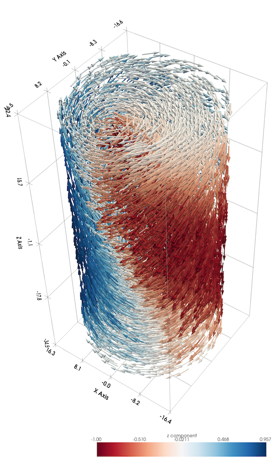
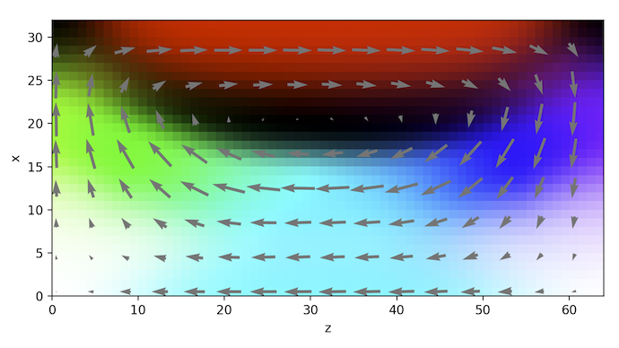
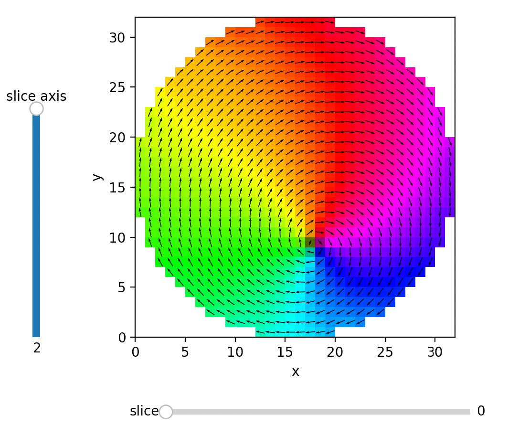
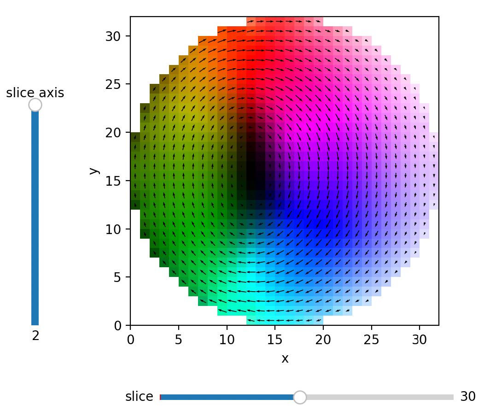
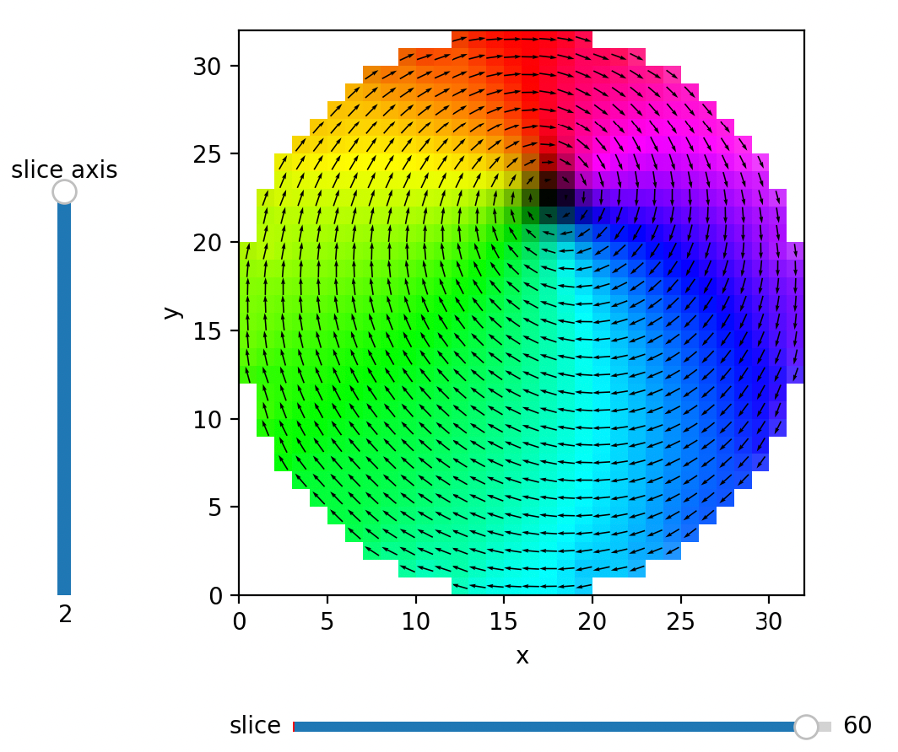

Usage
=====

Installation
------------

To use ThreeDViewer, first install it using pip:

.. code-block:: console

   (.venv) $ pip install ThreeDViewer

.. _example:

Example
-------
Using :func:`ThreeDViewer.vector.plot_vector_field()` allows interactive 3D visualization. This function uses pyvista
(VTK based) to plot the vector field

but it is hard to grasp what is happening inside the structure in this view.

Interactive slicing using :func:`ThreeDViewer.image.plot_3d()` is ideal for viewing the internal structure of vector
fields as shown below (click to enlarge):

|pic1| |pic2| |pic3|

The horizontal slider (bottom) allows for changing the slicing position, while the vertical slice (left) can be used to
select the axis to slice. In the example above, slicing is done along the *z* direction (index 2). In this view, it
is much easier to notice that the central vortex broadens in the middle of the structure and is pinched at the surfaces.

The arrows are optional in these plots, and by default, vectors that point out-of-plane are lighter in color, and
vectors that point into the plane are darker in color.

When only a single slice is of interest, :func:`ThreeDViewer.image.plot_quiver()` can be used, which allows for more
arrow design choices. An example use of this function is shown below:

This view demonstrates that there is also an elongated vortex topology along the *y* axis

Full Code
^^^^^^^^^
The full code from the ``examples.py`` file can be seen here:

.. raw:: html

    

    
<a>View Code</a>

.. include:: ../../ThreeDViewer/examples.py
    :literal:

.. raw:: html

   
